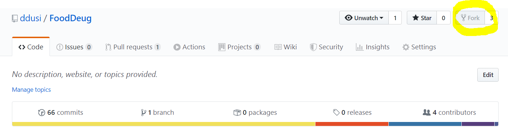
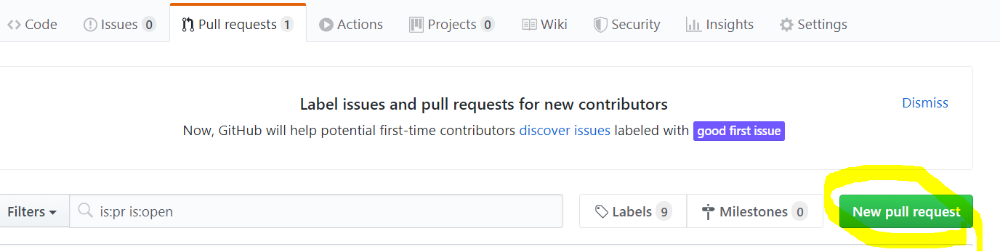
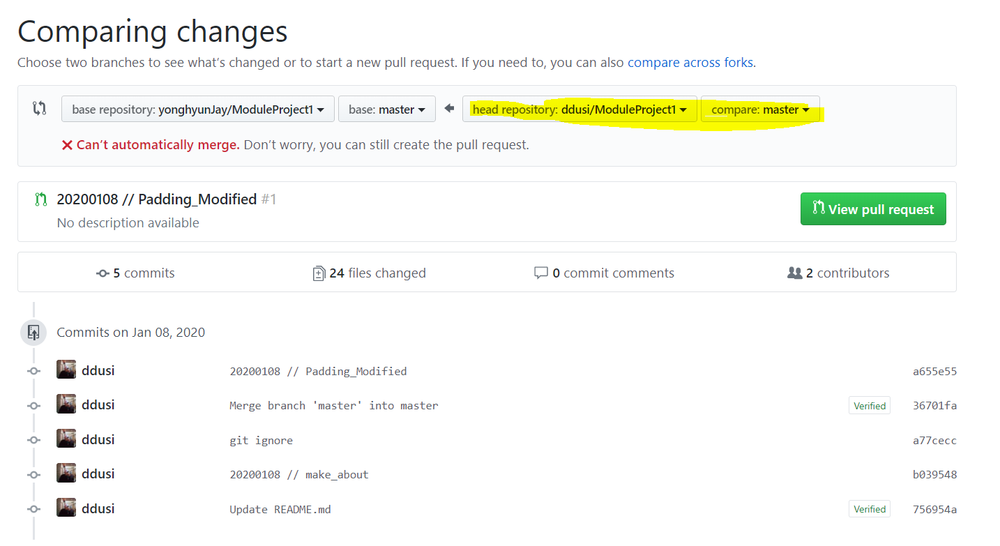

2020-02-04-collaborating on projects using github's fork function


## 3. github의 fork기능을 이용한 프로젝트 협력 

### collaborating on projects using github's fork function


github에 대해서 수업시간에 배웠지만, 각 브런치를 설정해 git-flow를 만들려고 하다보니 소규모 프로젝트에 너무 과한것 같았다. 그리고 현실적으로 git 설정에 너무 많은 시간을 빼앗기고 싶지 않았다 


- github의 fork 기능

  github에는 상대 repositories를 포크로 찍듯이 복사해오는 기능이 있다. 이 기능을 이용하여 Open project를 실제로 많이 이용하고 있다. 


- fork는 찍어오는 시점의 repositories를 가져온다. 

  fork를 이용해 프로젝트를 할때는 한사람의 repositories에서 팀원분들이 각각 fork를 해와야 한다. 이때, fork로 찍어오는 시점을 가져오기 때문에 항상 원작자 repositories를 pull로 당겨온 후에 push 요청을 해야한다. 




- 원작자 repositories에서 pull 요청하기

  


일단 내가 팀원이라면 fork를 당겨온 레파지토리에서 pull requests 페이지로 들어가 요청을 한다. 

이때, 원작자 레파지토리에서 가져오는 것이기 때문에 내가 요청하고 내가 merge 승인을 해주면 된다.


- 원작자 repoditories에 push 하기!



똑같이 pull requests 페이지를 선택하여 New pull request를 선택하면 이러한 화면을 볼수 있다. 여기서 중요한 것은 화살표 방향이다. 내꺼에서 상대꺼에게 방향만 잘보면 pull push를 잘 할 수 있다. 


- github의 강력한 기능 **Resolving Merge Conflicts**

  ```python
  the number of planets are
  <<<<<<< HEAD
  nine
  =======
  eight
  >>>>>>> branch-a
  ```

  github는 아주 똑똑한 녀석이기 떄문에, 단순한 Conflicts는 github 페이지상에서 수정이 가능하다. 사용법은 아주 쉽기 때문에 Resolving Merge Conflicts 버튼을 눌러 따라해보자.


참고: https://github.com/codepath/android_guides/wiki/Collaborating-on-Projects-with-Git


